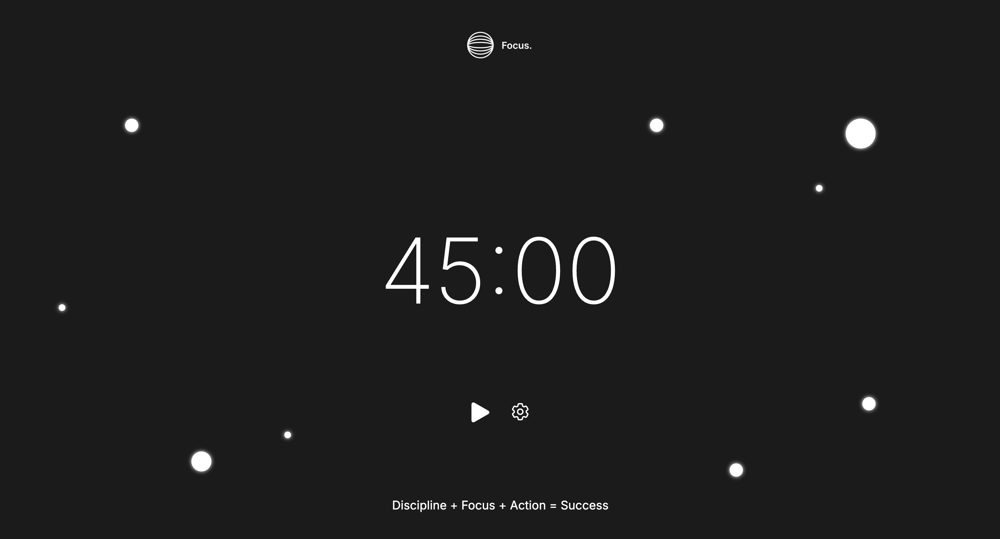

<!-- Title --> 
<h1 align="left">React Focus App</h1>

<!-- Description -->

This is a Timer application built using React. The app allows users to focus on their work for a set period, followed by a short break. It tracks the time using a circular progress bar and offers play, pause, and settings functionality. The timer switches automatically between work and break modes and can be customized based on user preferences.

<!-- Design -->
<h2 align="left">Design</h2>

    

<!-- Features --> 
<h2 align="left">Features</h2>
<ul align="left">
    <li><strong>Work and Break Modes:</strong> The app alternates between work and break modes, helping users follow the Pomodoro technique (e.g., 45-minute work session, followed by a 5-minute break).</li>
    <li><strong>Circular Progress Bar:</strong> The time remaining is displayed on a circular progress bar that dynamically updates as the timer counts down.</li>
    <li><strong>Play/Pause Controls:</strong> Users can start or pause the timer at any time with the play/pause button.</li> <li><strong>Automatic Mode Switch:</strong> The app automatically switches between work and break modes once the time is up.</li> <li><strong>Customizable Time Intervals:</strong> Users can customize the duration of the work and break periods via settings.</li>
    <li><strong>Persistent State:</strong> The timer maintains the current session’s state and resets properly when the mode switches.</li>
</ul> 

<!-- Technologies Used -->
<h2 align="left">Technologies Used</h2>

React, JavaScript (ES6+), HTML, CSS, Circular Progress Bar Library

<!-- Usage --> 
<h2 align="left">Usage</h2>
<ul align="left">
    <li><strong>Start the Timer:</strong> Click the "Play" button to start the Pomodoro timer. The timer will begin counting down the work period.</li>
    <li><strong>Pause the Timer:</strong> Click the "Pause" button to pause the current session. You can resume it later by clicking "Play" again.</li>
    <li><strong>Switch Between Modes:</strong> When the work timer ends, the app will automatically switch to break mode, and vice versa.</li>
    <li><strong>Adjust Settings:</strong> To customize the work and break durations, click the "Settings" button to open the settings menu.</li>
</ul> 

<!-- Acknowledgements -->
<h2 align="left">Acknowledgements</h2>

This Focus Timer app was created as part of a personal project to help improve productivity using the Pomodoro Technique. The design inspiration comes from various online resources and productivity apps.
